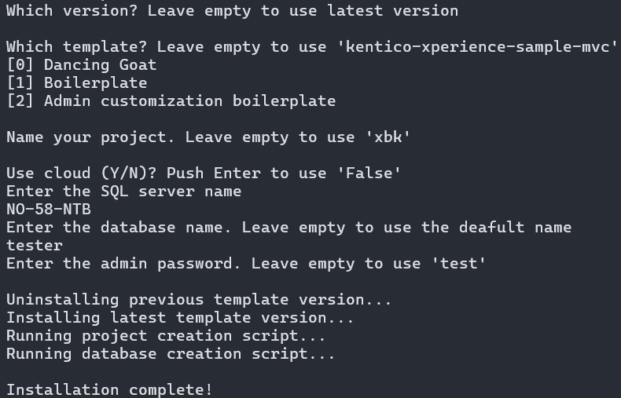

# Xperience Manager (xman)

## Installation

Run the following command from a command prompt such as Powershell:

`dotnet tool install Xperience.Xman -g`

## Usage

The following commands can be executed using the `xman` tool name:

- `install`

### Installing a new Xperience by Kentico project

1. Create an empty directory in the location you wish to install Xperience by Kentico
1. In a command prompt, navigate to the empty directory

    `cd C:\inetpub\wwwroot\xbk`

1. Run the `install` command which will begin the installation wizard:

    `xman install`