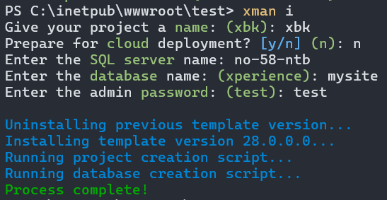

[](https://www.nuget.org/packages/Xperience.Xman#versions-body-tab)
[](https://github.com/kentico-ericd/xperience-manager/actions/workflows/build.yml)

# Xperience Manager (xman)

This tool simplifies the process of installing new Xperience by Kentico instances by providing an installation wizard.



## Installation

Run the following command from a command prompt such as Powershell:

```bash
dotnet tool install Xperience.Xman -g
```

## Usage

The following commands can be executed using the `xman` tool name:

- `?`, `help`
- `i`, `install`

### Installing a new Xperience by Kentico project

1. Create an empty directory in the location you wish to install Xperience by Kentico
1. In a command prompt, navigate to the empty directory

   ```bash
   cd C:\inetpub\wwwroot\xbk
   ```

1. Run the `install` command which will begin the installation wizard:

   ```bash
   xman install
   ```
